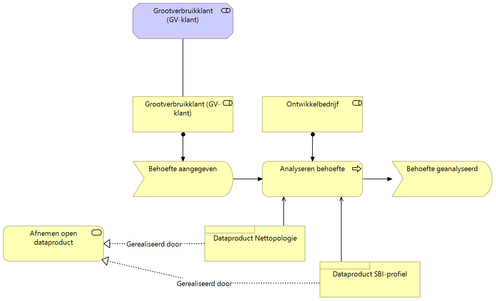

# Inleiding

> [!NOTE]
> TODO

# Akkoord

Dit ontwerp is akkoord bevonden door de volgende stakeholders:

- [ ] TODO

# Scope, strategie & motivatie

- [ ] TODO: beperken tot waardestroom "Optimaliseren van capaciteit voor lokale
  energiesystemen
- [ ] TODO: beperken tot capabilities van de netbeheerder om dataproducten aan
  te kunnen leveren
- [ ] TODO: input zijn functionele eisen, customer journey van WG EnergyHubs,
  Blauwdruk EIGEN, ChatGPT, Doelarchitectuur Datadelen (NBEA)
- [ ] TODO: Perspectief beperkt zich tot dat van regionale netbeheerder, met
  focus op het leveren van dataproducten
- [ ] TODO: Stakeholders (GV-klant, gemeente, ontwikkelbedrijf,
  realisatiebedrijf, exploitatiebedrijf)

# Functionele eisen

Functionele eisen specificeren de specifieke functionaliteiten en prestaties
die een systeem of product moet bieden om aan de behoeften en verwachtingen van
de gebruikers te voldoen. Ze beschrijven de vereiste taken, processen en
interacties die het systeem moet ondersteunen om de beoogde doelen te bereiken.

|#  |Als        |Wil ik|Want  |
|---|-----------|------|------|
| 1.|stakeholder|iets  |waarde|

# Kwaliteitseisen

> [!NOTE]
> Kwaliteitseisen (non-functionals) conform ISO/IEC 25010

# Future State (Soll)

In dit hoofdstuk wordt een gedetailleerd beeld geschetst van de gewenste
toekomstige situatie waarin de waardestroom "Optimaliseren van capaciteit voor
lokale energiesystemen" volledig is gerealiseerd. Er wordt beschreven hoe de
verwachte verbeteringen in efficiëntie, flexibiliteit en duurzaamheid van de
lokale energiesystemen tot stand komen.

> [!NOTE]
> Een waardestroom is een reeks stappen die een organisatie doorloopt om waarde
> te creëren en te leveren aan haar klanten, van begin tot eind. Het omvat alle
> activiteiten, van het identificeren van de behoefte tot het uiteindelijke
> leveren van het product of de dienst. Elke stap draagt bij aan het verhogen
> van de waarde voor de eindgebruiker.

Daarnaast wordt belicht hoe de geïmplementeerde oplossingen bijdragen aan het
optimaal benutten van beschikbare energiebronnen en aan het versterken van de
energie-infrastructuur voor de lange termijn.

## Value Stream: Optimaliseren van capaciteit voor lokale energiesystemen

In deze sectie wordt de waardestroom stap voor stap uitgewerkt, waarbij elke
stap van de waardestroom gedetailleerd wordt beschreven om de optimale
capaciteit voor lokale energiesystemen te realiseren. De uitwerking van elke
stap van de waardestroom beschrijft het benodigde landschap vanuit proces-,
applicatie-, platform- en dataperspectief.

> [!NOTE]
> Voor de inhoudelijke uitwerking van de waardestroom wordt de [Blauwdruk
> Energy Hubs](https://www.eigen-energyhubs.nl/de-blauwdruk/) van EIGEN
> gebruikt. Voor dit ontwerp worden de meest relevante punten als context
> opgevoerd. Voor meer detail, zie de Blauwdruk.

### Stappen

Elke stap in de waardestroom creëert waarde voor de primaire stakeholder, de
grootverbruikklant (GV-klant):

|Stap                       |Waarde                                           |
|---------------------------|-------------------------------------------------|
|**Verkennen**              |Biedt inzicht in het potentieel van het opzetten van een *Energy Hub* en brengt mogelijke risico's in kaart|
|**Onderzoek & ontwerp**    |Legt de juridische en technische basis en voorziet in een concreet implementatiepad|
|**Realiseren**             |Implementatie van het ontwerp voor de *Energy Hub* en verhoogt operationele capaciteit|
|**Operationeel beheer**    |Biedt inzicht en optimaliseert prestaties van de *Energy Hub*|
|**Evaluatie & verbetering**|Voorziet in langdurige efficiëntie en duurzaamheid van de *Energy Hub*|

Alle bovengenoemde stappen worden verder toegelicht in de volgende
hoofdstukken.

### Capabilities

Vanuit het perspectief van de dataleverende netbeheerder moeten een aantal
*capabilities* ingevuld worden om daadwerkelijk de gevraagde dataproducten te
kunnen leveren.

> [!NOTE]
> Een *capability* verwijst naar de specifieke vaardigheden, middelen of
> processen die een organisatie in staat stellen om bepaalde taken effectief
> uit te voeren en strategische doelstellingen te bereiken. Benoemde
> capabilities zijn onderdeel van het [NBility Capability
> Model](https://www.edsn.nl/nbility-model/).

|Capability                                       |Beschrijving                                           |
|-------------------------------------------------|-------------------------------------------------------|
|C.6.4.1 Marktdata beschikbaar maken voor partijen|Beschikbaar maken van **gesloten data** als dataproduct|
|C.6.4.2 Open data beschikbaar maken voor derden  |Beschikbaar maken van **open data** als dataproduct    |

*Business Services* vanuit capabilitie duiden welke ondersteuning vanuit de
netbeheerders vereist is voor uitvoer van de waardestroomstappen om tot een
geoptimaliseerd lokaal energiesysteem te komen.

## Verkennen

Onderzoeken met welke lokale omstandigheden rekening kan en moet worden
gehouden en of er voldoende momentum kan worden gecreëerd bij bedrijven om een
(voorloper voor) een *Energy Hub* op te zetten.

Het diagram illustreert hoe de aangegeven behoefte tot het optimaliseren van
capaciteit van de GV-klant het proces "Analyseren behoefte" start, wat leidt
tot de status "behoefte geanalyseerd". Binnen dit proces wordt de basis gelegd
voor verdere stappen in de waardestroom. Het betrokken Ontwikkelbedrijf is
verantwoordelijk voor het uitvoeren van de analyse, namens de GV-klant.

Ter ondersteuning van de analyse worden de volgende dataproducten gevraagd:

* **Nettopologie**: beschrijving van de topologie van een (mogelijke) *Energy
  Hub*. Het gaat hier zowel om informatie van *aansluitingen* die in aanmerking
  komen voor deelname aan de *Energy Hub*, als geografische informatie;
* TODO: meer dataproducten? Herleiden naar functionele eisen (kan in later
  hoofdstuk).

Deze dataproducten worden gerealiseerd via capability [C.6.4.2 Open data
beschikbaar maken voor derden](#c642-open-data-beschikbaar-maken-voor-derden).

## Onderzoek en ontwerp

> [!NOTE]
> TODO

## Realiseren

> [!NOTE]
> TODO

## Operationeel beheer

> [!NOTE]
> TODO

## Evaluatie en verbeteren

> [!NOTE]
> TODO

## C.6.4.1 Marktdata beschikbaar maken voor partijen

> [!NOTE]
> TODO

## C.6.4.2 Open data beschikbaar maken voor derden

> [!NOTE]
> TODO

# Dataproducten

## Dataproduct: Nettopologie

> [!NOTE]
> TODO

# Beslissingen & aannames

> [!NOTE]
> TODO

# Uitzonderingen op architectuurprincipes

> [!NOTE]
> TODO

# Risico's & mitigatie

> [!NOTE]
> TODO
